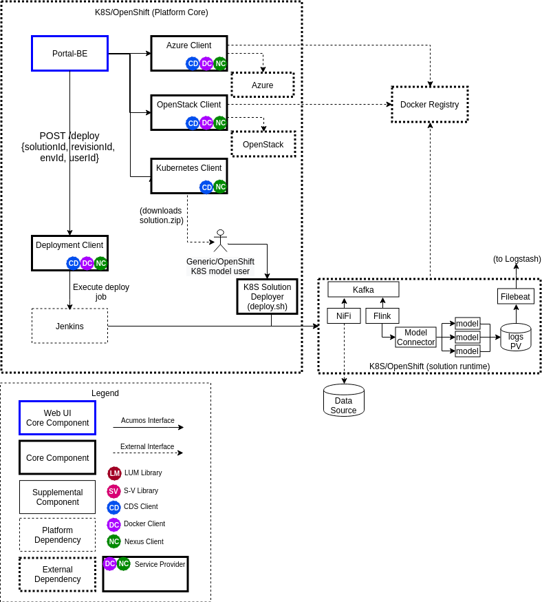
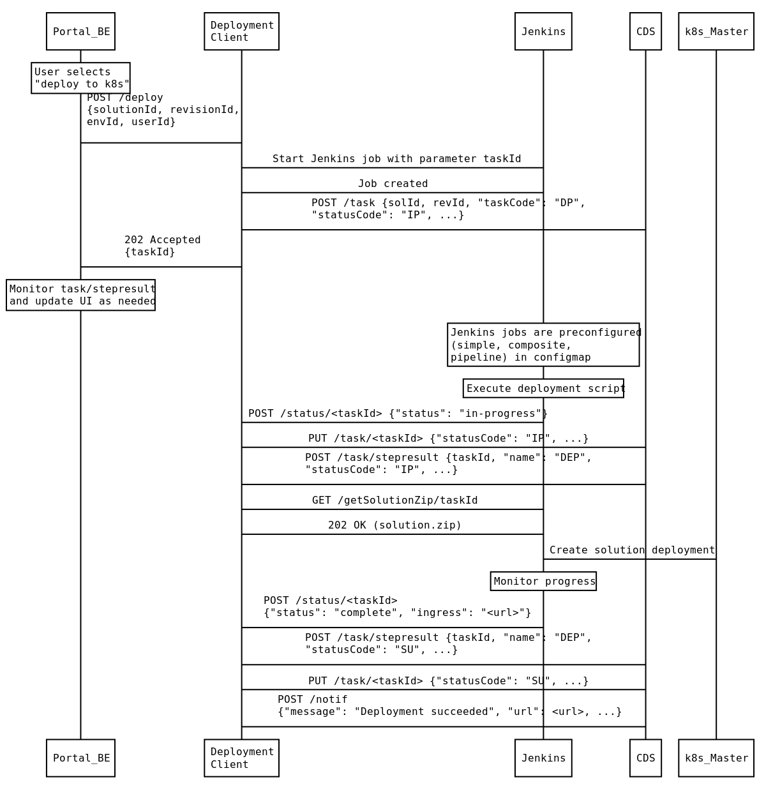

..
  ===============LICENSE_START=======================================================
  Acumos CC-BY-4.0
  ===================================================================================
  Copyright (C) 2017-2019 AT&T Intellectual Property & Tech Mahindra. All rights reserved.
  ===================================================================================
  This Acumos documentation file is distributed by AT&T and Tech Mahindra
  under the Creative Commons Attribution 4.0 International License (the "License");
  you may not use this file except in compliance with the License.
  You may obtain a copy of the License at
..
  http://creativecommons.org/licenses/by/4.0
..
  This file is distributed on an "AS IS" BASIS,
  See the License for the specific language governing permissions and
  limitations under the License.
  ===============LICENSE_END=========================================================
..

========================================
Acumos Deployment Client Developer Guide
========================================

-----
Scope
-----

This guide covers the design of the Deployment Client for the Acumos platform,
as of the Clio (3rd) release.

............................
Previously Released Features
............................

This is the first release of the Deployment Client, although much of the design
of the Boreas release features Kubernetes Client will be reused/enhanced in this
release, for use in the Deployment Client.

........................
Current Release Features
........................

Current release features include:

* deployment of Acumos solutions (simple models, composite models, and NiFi
  pipelines) into pre-configured kubernetes clusters
* use of Jenkins as a job executor for deployment tasks

------------
Architecture
------------

The following diagram shows the architecture of the Deployment-related clients
of the Acumos platform, and the new Deployment Client. The current
Deployment-related clients (Azure Client, OpenStack Client, Kubernetes Client)
are not affected by the Deployment Client design or features, but are shown for
context. Also shown is a hypothetical solution as deployed in a target
kubernetes environment, and dependencies of that kubernetes environment and
solution/support components deployed in it, on the Acumos platform and its
dependencies (e.g. a docker registry, and ELK stack).

The typical sequence of messages across Acumos components for a solution
deployment is shown in the figure below.

.....................
Functional Components
.....................

*****************
Deployment Client
*****************

The Deployment Client has largely the same role/design as the current
Kubernetes Client, with these key differences:

* solution deployment is automated
* the solution.zip package is designed for use in shared k8s environments, e.g.

  * since target namespaces are likely to be used for deployment of multiple
    solutions, or multiple instances of the same solution, all resources created
    in the namespace are uniquely identified, using a UUID (the deployment
    task trackingId)
  * since use of cluster ingress is likely required, cluster ingress rules are
    used to provide unique URLs where the the solution user can access the
    solution APIs
  * uses dynamic nodePorts where needed
  * does not depend upon privileged operation for containers

******
Portal
******

A new "deploy to k8s" option will be added to the "Deployment" menu for
solutions. When the user selects it, the Portal will:

* present a dialog in which the user can select a target k8s env from a set of
  pre-configured values (set in site-config value for "k8sClusters", as a list
  of names)
* invoke the /deploy API of the Deployment Client

The Portal will have no further role in the deployment process, but the user
will get a notification created by the Deployment Client when the job is
complete, that will include important information such as the job status
and the assigned ingress URL.

************
ML Workbench
************

When a Predictor is created, the MLWB will provide a "deploy to k8s" option
to the user. When the user selects it, the MLWB will:

* in the dialog, allow the user to select the target k8s env from a set of
  pre-configured values (set in site-config value for "k8sClusters", as a list
  of names).
* invoke the /deploy API of the Deployment Client
* monitor the status of the taskId returned by the /deploy API
* when the task is complete, present the result to the user (success/fail)

  * for success, retrieve the ingress URL from the Notification that was created
    for the user, and save the URL in the Predictor object

Post-deployment, the Predictor service can take further actions using the
trackingId value related to the deployment taskId, via an API provided by the
Deployment Client (design is WIP).

..........
Interfaces
..........

************
Exposed APIs
************

The base URL for the APIs below is: http://<deployment-client-service-host>:<port>,
where 'deployment-client-service-host' is the routable address of the
Deployment Client service in the Acumos platform deployment, and port is the
assigned port where the service is listening for API requests, by default 8080.

++++++++++++++++++
Deployment Request
++++++++++++++++++

The Deployment Client service exposes the following API that initiates
solution deployment. In the successful case, it will return a JSON response that
includes the assigned taskId.

* URL resource: /deploy

* Supported HTTP operations

  * POST

    * Body

      * {"solutionId": "<id>", "revisionId": "<id>", "envId": "<id>",
         "userId": <id> }

        * solutionId: id of a solution in the CDS
        * revisionId: id of a solution revision in the CDS
        * envId: id of a target kubernetes environment, as configured in the
          Spring environment for the Deployment Client, and in the site-config
          "k8sCluster" key
        * userId: CDS id of the user requesting deployment

    * Response

      * 202 Accepted

        * meaning: request accepted, in progress
        * Body

          * { "taskId": <taskId> }

            * taskId: the taskId that has been created for the deployment

      * 404 Not Found

        * meaning: the solutionId, revisionId, envId, or userId was not found

++++++++++++++++
Get Solution Zip
++++++++++++++++

The Deployment Client service exposes the following API where Jenkins can obtain
a solution.zip package to be used in solution deployment. In the successful case,
it will return a solution.zip file with the package to be deployed.

* URL resource: /getSolutionZip/<taskId>

  * taskId: taskId associated with the deployment task

* Supported HTTP operations

  * GET

    * Response

      * 200 OK

        * meaning: request received, content provided
        * Body
          * the solution.zip package generated for the taskId

      * 404 Not Found

        * meaning: taskId not found

+++++++++++++++++
Deployment Status
+++++++++++++++++

The Deployment Client service exposes the following API where Jenkins can post
updates on the status of solution deployment.

* URL resource: /status/<taskId>

  * taskId: taskId associated with the deployment task

* Supported HTTP operations

  * POST

    * Body

      * {"status": "<status>", "reason": "<reason>"}

        * status: status of the job

          * created: job has been created
          * in-progress: job has started
          * complete: job is complete
          * failed: job has failed

        * reason: for failed jobs, an explanatory reason if available

    * Response

      * 200 OK

        * meaning: request received

*************
Consumed APIs
*************

++++++++++++++++++++++
Jenkins Job Invocation
++++++++++++++++++++++

The Deployment Client will use the Jenkins job creation API to start jobs that
have these features:

* take a single parameter: taskId
* POST notifications of job progress (created, in progress, failed, complete)
  with the taskId using the `Deployment Status`_ API
* deploy the solution using the <taskId>.zip in a similar manner to the Boreas
  kubernetes-client design

As described in the Jenkins documentation for the
`Remote access API <https://wiki.jenkins.io/display/JENKINS/Remote+access+API>`_
the API requires an HTTP POST to the Jenkins server with URL formatted as
"JENKINS_URL/job/JOB_NAME/build", with user credentials and request body in
JSON, e.g.

.. code-block:: json

  {"parameter": [{"name": "taskId", "value": "<id>"}]}
..

The value of JENKINS_URL and the user credentials will be provided in the
Deployment Client Spring environment as jenkins.url as described in
`Jenkins Configuration`_. JOB_NAME will be replaced with the applicable job
name as described in `Jenkins Configuration`_.

++++++++++++++++++
Common Dataservice
++++++++++++++++++

As used by the current kubernetes-client service, with addition of the
Task Controller APIs for tasks and stepresults.

+++++
Nexus
+++++

As used by the current kubernetes-client service.

----------------
Component Design
----------------

.................
Deployment Client
.................

Upon a request to the /deploy API, the Deployment Client will:

* create a task (taskCode "DP", statusCode": "IP") and stepresult (name
  "DEP", statusCode": "IP") entry in the CDS
* return 202 Accepted to the Portal-BE, with the taskId
* start the appropriate Jenkins job as specified in the Spring environment with
  the parameter 'taskId' as created above

  * the taskId is used as a convenient unique identifier for the current task
    and will be used along with the generated trackingId by Jenkins, to
    uniquely identify the solution deployment so information about the deployed
    solution can be retrieved later, e.g. for presentation to the user in the ML
    Workbench UI.
  * the appropriate job for the solution types will be provided as a value under
    the Spring environment, as described under `Jenkins Configuration`_

* wait for status updates via the /status API, and save the status events to
  the CDS task table, for the taskId and name 'DEP'
* wait for Jenkins to retrieve the solution package via the /getSolutionZip API
  and then

  * prepare a solution package per `Solution Package Preparation`_

*********************
Jenkins Configuration
*********************

The Deployment Client Spring environment will include a block for the configurable
parameters to be used in Jenkins APIs:

.. code-block:: json

  "jenkins": {
    "url": "http://jenkins-service:8080",
    "user": "<ACUMOS_DOMAIN>",
    "password": "<password>",
    "job": [
      { "simple": "<jobname>" },
      { "composite": "<jobname>" },
      { "nifi": "<jobname>" }
    ]
  }
..

  * <ACUMOS_DOMAIN> will be the default user ID to use, and ensures the Jenkins
    service, if shared by multiple Acumos platforms, can be configured for each
  * <password> will be specified by the Admin deploying the platform
  * <jobname> is the name of a job configured in Jenkins; by default, these will
    configured for use by the Jenkins service at startup
  * additional jobs can be created in Jenkins and mapped to new/updated entries
    in the Deployment Client config, by updating this Spring environment variable
    and redeploying the Deployment Client

**********************
k8sCluster Site Config
**********************

On startup, the Deployment Client will create or update a new site-config key,
"k8sCluster" as described below. The default value for this key will be provided
in the Spring environment variable k8sCluster:

.. code-block:: json

  "k8sCluster": "[
    { \"name\": \"cluster1\" },
    { \"name\": \"cluster2\" },
    { \"name\": \"cluster3\" }
  ]"
..

The example above is simply a placeholder, expected to be updated by the
Acumos platform admin. The values represent arbitrary identifiers of k8s
environments that will be configured as part of the Jenkins solution deployment
job.

The Deployment Client will save the Spring environment value as an escaped JSON
string, for the site-config key "k8sCluster", if it doesn't already exist.

Adding/updating clusters will require updating the Deployment Client template
and applying the changes, to restart the Deployment Client.

****************************
Solution Package Preparation
****************************

Solution packages will be prepared on-demand, and will be cached until Jenkins
retrieves the package, in the folder /app/cache with the name <taskId>.zip, where
taskId is the id of the task related to the deployment.

The Deployment Client will follow the steps below in preparing the solution
deployment package:

* get the following artifacts if existing from Nexus, by querying the CDS for
  the set of solution/revision artifacts

  * blueprint.json
  * databroker.json

* if a blueprint.json artifact was found, this is a composite solution and the
  following actions are taken

  * get the model.proto artifact for each solution model microservice, for the
    model revision included in the solution
  * create a kubernetes service+deployment template as solution.yaml including
    all the solution components included in blueprint.json. See below for an
    example.
  * create a dockerinfo.json file using the example below
  * create an environment variable script "deploy_env.sh", with these values

    * DEPLOYMENT_CLIENT_API_BASE_URL: Base URL (scheme://domain:port) of Deployment Client
    * ACUMOS_DOCKER_REGISTRY: Base URL (https://domain:port) of docker registry
    * ACUMOS_DOCKER_REGISTRY_USER: docker registry username
    * ACUMOS_DOCKER_REGISTRY_PASSWORD: docker registry password
    * LOGSTASH_HOST: Hostname/FQDN of the Logstash service
    * LOGSTASH_IP: IP address of the Logstash service
    * LOGSTASH_PORT: Port of the Logstash service
    * K8S_CLUSTER: name of a pre-configured k8s cluster
    * TRACKING_ID: trackingId for the deployment task
    * TASK_ID: taskId for the deployment
    * SOLUTION_TYPE: simple|composite|pipeline
    * SOLUTION_NAME: name of the solution
    * SOLUTION_DOMAIN: IP address or resolvable FQDN/hostname of the k8s cluster
      ingress
    * SOLUTION_MODEL_RUNNER_STANDARD: v1|v2
    * SOLUTION_ID: Solution ID for simple solution
    * COMP_SOLUTION_ID: Solution ID for composite solution (if applicable)
    * COMP_REVISION_ID: Revision ID for composite solution (if applicable)

* if a blueprint.json artifact was not found, this is a simple solution and a
  kubernetes service+deployment template is created, as solution.yaml. See below
  for an example.
* In the generated solution.yaml, specify for each model microservice the
  hostname:port for the Acumos platform docker proxy, e.g.
  "$ACUMOS_DOMAIN:$ACUMOS_DOCKER_PROXY_PORT" in the examples below
* create a zip archive as <trackingId>.zip containing:

  * deploy.sh, from /app/config/jobs/solution_deploy
  * solution.yaml, generated as described above
  * for a composite solution:

    * blueprint.json, from Nexus
    * dockerinfo.json, created as described below
    * databroker.json, from Nexus (if Data Broker is included in the solution)
    * a "microservice" subfolder, with subfolders named for each model
      microservice, containing the model.proto for that model (if Probe is
      included in the solution)

Design notes for the solution.yaml structure:

* to support distribution of solution microservices and other Acumos components
  (Data Broker, Model Connector, Probe) across nodes in multi-node kubernetes
  clusters, each microservice and the Acumos components are deployed using
  a specific service and related deployment spec.
* services which require external exposure on the cluster are provided dynamic
  nodePort assignments. These include:

  * simple solution microservices, to expose its protobuf API
  * for composite solutions, as applies to the specific solution design

    * Data Broker (if included, for its API)
    * Model Connector (for receiving pushed model data directly)
    * any model microservices that require external exposure for receiving data

Following are a series of examples of solution.yaml templates, from simple to
complex. The first is an example of the generated solution.yaml template for a
simple solution. Notes on the template attributes:

* the templates are guaranteed to be unique in the
* the model microservice is directly exposed at a dynamic NodePort
* the cluster-internal port value 8557 is selected per the Acumos convention
  of assigning model microservices ports starting at 8557
* the model pod created by the deployment is exposed at port 3330, which is the
  Acumos convention for microservices as built by the microservice-generation
  component of the Acumos platform
* the namespace is as specified for the target kubernetes environment, in the
  Deployment Client Spring environment
* the imagePullSecrets value "acumos-registry" refers to the cached credentials
  for the user for access to the Acumos platform docker registry
* so that the model microservice images and Data Broker image (in a later
  example) can be pulled from the Acumos platform repository, the host and port
  in the image name are set to values for the docker-proxy

.. code-block:: yaml

  apiVersion: v1
  kind: Service
  metadata:
    namespace: <NAMESPACE>
    name: padd-<TRACKING_ID>
    labels:
      app: padd-<TRACKING_ID>
      trackingid: <TRACKING_ID>
  spec:
    selector:
      app: padd-<TRACKING_ID>
    type: NodePort
    ports:
    - name: protobuf-api
      port: 8557
      targetPort: 3330
  ---
  apiVersion: apps/v1
  kind: Deployment
  metadata:
    namespace: <NAMESPACE>
    name: padd-<TRACKING_ID>
    labels:
      app: padd-<TRACKING_ID>
      trackingid: <TRACKING_ID>
  spec:
    replicas: 1
    selector:
      matchLabels:
        app: padd-<TRACKING_ID>
    template:
      metadata:
        labels:
          app: padd-<TRACKING_ID>
          trackingid: <TRACKING_ID>
      spec:
        imagePullSecrets:
        - name: acumos-registry
        containers:
        - name: padd-<TRACKING_ID>
          image: $ACUMOS_DOMAIN:$ACUMOS_DOCKER_PROXY_PORT/padd_cee0c147-3c64-48cd-93ae-cdb715a5420c:3
          ports:
          - name: protobuf-api
            containerPort: 3330
        restartPolicy: Always
..

Example of the generated solution.yaml template for a complex (composite)
solution with two model microservices, Data Broker, and Model Connector.
Notes on the template attributes:

* the model microservices are accessed via the Data Broker or Model Connector,
  which are externally exposed at dynamic NodePorts
* the Data Broker, Model Connector, and Probe are exposed internal to the cluster
  at the ports specified in the Acumos project build processes for those images
* the Model Connector is also externally exposed at a dynamic NodePort so that
  it can be configured by deploy.sh via its APIs, or used directly to push
  data to the solution
* the names given to the services defined for each model microservice serve as
  resolvable hostnames within the cluster namespace, so their protobuf-api
  interfaces can be accessed by other pods in the cluster e.g. Model Connector,
  independent of the assigned service IP
* the image name (repository and image version) for the Model Connector is set
  by an environment parameter in the kubernetes-client template
* the Data Broker image name is set per the "datasource" type model that the user
  selected in creating the composite solution

.. code-block:: yaml

  ---
  apiVersion: v1
  kind: Service
  metadata:
    namespace: <NAMESPACE>
    name: padd-<TRACKING_ID>
  spec:
    selector:
      app: padd-<TRACKING_ID>
    type: ClusterIP
    ports:
    - name: protobuf-api
      port: 8556
      targetPort: 3330
  ---
  apiVersion: apps/v1
  kind: Deployment
  metadata:
    namespace: <NAMESPACE>
    name: padd-<TRACKING_ID>
    labels:
      app: padd-<TRACKING_ID>
      trackingid: <TRACKING_ID>
  spec:
    replicas: 1
    selector:
      matchLabels:
        app: padd-<TRACKING_ID>
    template:
      metadata:
        labels:
          app: padd-<TRACKING_ID>
          trackingid: <TRACKING_ID>
      spec:
        imagePullSecrets:
        - name: acumos-registry
        containers:
        - name: padd-<TRACKING_ID>
          image: opnfv02:30883/padd_3abecdc4-7f91-41bd-98dd-a14354089f68:1
          ports:
          - name: protobuf-api
            containerPort: 3330
  ---
  apiVersion: v1
  kind: Service
  metadata:
    namespace: <NAMESPACE>
    name: square-<TRACKING_ID>
  spec:
    selector:
      app: square-<TRACKING_ID>
    type: ClusterIP
    ports:
    - name: protobuf-api
      port: 8556
      targetPort: 3330
  ---
  apiVersion: apps/v1
  kind: Deployment
  metadata:
    namespace: <NAMESPACE>
    name: square-<TRACKING_ID>
    labels:
      app: square-<TRACKING_ID>
      trackingid: <TRACKING_ID>
  spec:
    replicas: 1
    selector:
      matchLabels:
        app: square-<TRACKING_ID>
    template:
      metadata:
        labels:
          app: square-<TRACKING_ID>
          trackingid: <TRACKING_ID>
      spec:
        imagePullSecrets:
        - name: acumos-registry
        containers:
        - name: square-<TRACKING_ID>
          image: opnfv02:30883/square_d5782393-44ac-4ca4-8165-da6e8ac636c2:1
          ports:
          - name: protobuf-api
            containerPort: 3330
  ---
  apiVersion: v1
  kind: Service
  metadata:
    namespace: <NAMESPACE>
    name: modelconnector-<TRACKING_ID>
  spec:
    selector:
      app: modelconnector-<TRACKING_ID>
    type: NodePort
    ports:
    - name: mc-api
      port: 8555
      targetPort: 8555
  ---
  apiVersion: apps/v1
  kind: Deployment
  metadata:
    namespace: <NAMESPACE>
    name: modelconnector-<TRACKING_ID>
    labels:
      app: modelconnector-<TRACKING_ID>
      trackingid: <TRACKING_ID>
  spec:
    replicas: 1
    selector:
      matchLabels:
        app: modelconnector-<TRACKING_ID>
    template:
      metadata:
        labels:
          app: modelconnector-<TRACKING_ID>
          trackingid: <TRACKING_ID>
      spec:
        imagePullSecrets:
        - name: acumos-registry
        containers:
        - name: modelconnector-<TRACKING_ID>
          image: nexus3.acumos.org:10002/blueprint-orchestrator:2.0.13
          ports:
          - name: mc-api
            containerPort: 8555
          volumeMounts:
          - mountPath: /logs
            name: logs
        restartPolicy: Always
        volumes:
        - name: logs
          hostPath:
            path: /var/acumos/log
..

The included dockerinfo.json can be created directly by the kubernetes-client
as both the container name and the cluster-internal address (resolvable
cluster-internal hostname, and port) of each container can be pre-determined
per the assignments in solution.yaml as above. Example of dockerinfo.json for
the composite solution above:

.. code-block:: json

  {
    "docker_info_list": [
      {
        "container_name": "databroker",
        "ip_address": "databroker",
        "port": "8556"
      },
      {
        "container_name": "modelconnector",
        "ip_address": "modelconnector",
        "port": "8555"
      },
      {
        "container_name": "padd",
        "ip_address": "padd",
        "port": "8557"
      },
      {
        "container_name": "square",
        "ip_address": "square",
        "port": "8558"
      }
    ]
  }
..

.........
deploy.sh
.........

deploy.sh will be executed by the Jenkins job created for the deployment task,
and will take the following actions to deploy the solution:

* login to the Acumos platform docker proxy using the docker-proxy username
  and password from deploy_env.sh
* login to the Acumos project docker registry (current credentials are provided
  as default values in deploy.sh)
* create a secret "acumos-registry" using ~/.docker/config.json
* invoke kubectl to deploy the services and deployments in solution.yaml
* monitor the status of the Data Broker service and deployment, and when they are
  running, send Data Broker.json to the Data Broker via its /configDB API
* monitor the status of all other services and deployments, and when they are
  running

  * create dockerinfo.json with the service name, assigned IP address, and
    port of each service defined in solution.yaml
  * send dockerinfo.json to the Model Connector service via the /putDockerInfo
    API
  * send blueprint.json to the Model Connector service via the /putBlueprint API
