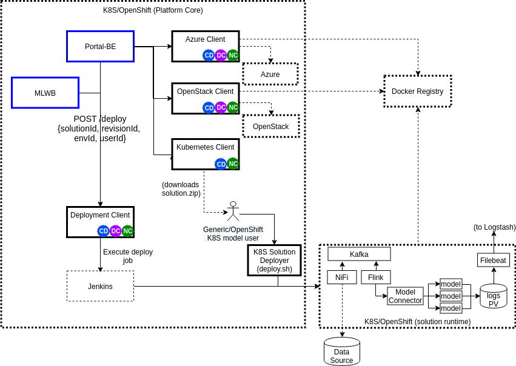
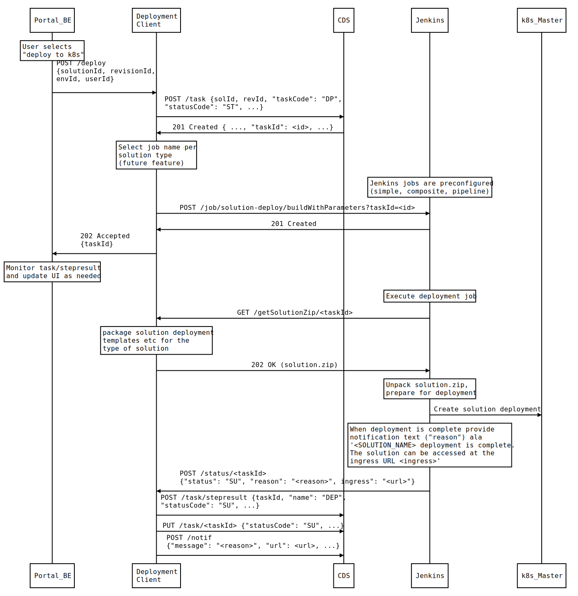

..
  ===============LICENSE_START=======================================================
  Acumos CC-BY-4.0
  ===================================================================================
  Copyright (C) 2017-2019 AT&T Intellectual Property & Tech Mahindra. All rights reserved.
  ===================================================================================
  This Acumos documentation file is distributed by AT&T and Tech Mahindra
  under the Creative Commons Attribution 4.0 International License (the "License");
  you may not use this file except in compliance with the License.
  You may obtain a copy of the License at
..
  http://creativecommons.org/licenses/by/4.0
..
  This file is distributed on an "AS IS" BASIS,
  See the License for the specific language governing permissions and
  limitations under the License.
  ===============LICENSE_END=========================================================
..

========================================
Acumos Deployment Client Developer Guide
========================================

-----
Scope
-----

............................
Previously Released Features
............................

........................
Current Release Features
........................

------------
Architecture
------------

The typical sequence of messages across Acumos components for a solution
deployment is shown in the figure below.

.....................
Functional Components
.....................

..........
Interfaces
..........

************
Exposed APIs
************

The base URL for the APIs below is: http://<deployment-client-service-host>:<port>,
where 'deployment-client-service-host' is the routable address of the
Deployment Client service in the Acumos platform deployment, and port is the
assigned port where the service is listening for API requests.

++++++++++++++++++
Deployment Request
++++++++++++++++++

The Deployment Client service exposes the following API that initiates
solution deployment.

* URL resource: /deploy

* Supported HTTP operations

  * POST

    * Body

      * {"solutionId": "<id>", "revisionId": "<id>", "envId": "<id>",
         "userId": <id> }

        * solutionId: id of a solution in the CDS
        * revisionId: id of a solution revision in the CDS
        * envId: id of a target kubernetes environment, as configured in the
          Spring environment for the Deployment Client
        * userId: CDS id of the user requesting deployment

    * Response

      * 202 Accepted

        * meaning: request accepted, in progress

      * 404 Not Found

        * meaning: the solutionId, revisionId, envId, or userId was not found

++++++++++++++++
Get Solution Zip
++++++++++++++++

The Deployment Client service exposes the following API where Jenkins can obtain
the solution.zip package to be used in solution deployment.

* URL resource: /getSolutionZip

* Supported HTTP operations

  * GET

    * Body

      * {"taskId", "<id>"}

        * taskId: taskId that was provided to Jenkins when the job was started

    * Response

      * 200 OK

        * meaning: request received, content provided
        * Body
          * the solution.zip package generated for the taskId

      * 404 Not Found

        * meaning: taskId not found

+++++++++++++++++
Deployment Status
+++++++++++++++++

The Deployment Client service exposes the following API where Jenkins can post
updates on the status of solution deployment.

* URL resource: /status

* Supported HTTP operations

  * POST

    * Body

      * {"taskId", <taskId>, "status": "<status>", "reason": "<reason>"}

        * taskId: taskId to associate with the job
        * status: status of the job

          * created: job has been created
          * in-progress: job has started
          * complete: job is complete
          * failed: job has failed

        * reason: for failed jobs, an explanatory reason if available

    * Response

      * 200 OK

        * meaning: request received

*************
Consumed APIs
*************

++++++++++++++++++++
Jenkins Job Creation
++++++++++++++++++++

The Deployment Client will use the Jenkins job creation API to start jobs that
have these features:

* take a single parameter: taskId
* POST notifications of job progress (created, in progress, failed, complete)
  with the taskId
* deploy the solution using the solution.zip in a similar manner to the Boreas
  k8s-client design

The Jenkins template for these jobs will be configurable through a kubernetes
configmap, so that the templates can be updated/customized as needed, without
requiring a new Deployment Client version.

++++++++++++++++++
Common Dataservice
++++++++++++++++++

As used by the current kubernetes-client service.

+++++
Nexus
+++++

As used by the current kubernetes-client service.

----------------
Component Design
----------------

.................
Deployment Client
.................

Upon a request to the /deploy API, the Deployment Client will:

* create a task (taskCode "DP", statusCode": "IP") and stepresult (name
  "DEP", statusCode": "IP") entry in the CDS
* return 202 Accepted to the Portal-BE, with the taskId
* prepare a solution package per `Solution Package Preparation`_, and cache the
  package under /app/cache/<taskId>.zip
* create a Jenkins job to deploy the solution
* start the Jenkins job with the parameter 'taskId' as created above
* wait for status updates via the /status API, and save the status events to
  the CDS task table, for the taskId and name 'DEP'
* wait for Jenkins to retrieve the solution package via the /getSolutionZip API

  * once the solution package has been retrieved, delete it from /app/cache/

............................
Solution Package Preparation
............................

Solution packages will be prepared on-demand, and will be cached until Jenkins
retrieves the package, in the folder /app/cache with the name <taskId>.zip, where
taskId is the id of the task related to the deployment.

The Deployment Client will follow the steps below in preparing the solution
deployment package:

* get the following artifacts if existing from Nexus, by querying the CDS for
  the set of solution/revision artifacts

  * blueprint.json
  * databroker.json

* if a blueprint.json artifact was found, this is a composite solution and the
  following actions are taken

  * get the model.proto artifact for each solution model microservice, for the
    model revision included in the solution
  * create a kubernetes service+deployment template as solution.yaml including
    all the solution components included in blueprint.json. See below for an
    example.
  * For a solution that does not include the Data Broker, the Model Connector
    service will be assigned a "type: NodePort" port with nodePort value of
    30855, so that data can be directly pushed to the solution
  * create a dockerinfo.json file using the example below
  * create an environment variable script "deploy_env.sh", with these values

    * SOLUTION_MODEL_RUNNER_STANDARD: v1|v2
    * SOLUTION_ID: Solution ID for simple solution
    * COMP_SOLUTION_ID: Solution ID for composite solution (if applicable)
    * COMP_REVISION_ID: Revision ID for composite solution (if applicable)
    * LOGSTASH_HOST: IP/FQDN of the Logstash service
    * LOGSTASH_PORT: Port of the Logstash service

* if a blueprint.json artifact was not found, this is a simple solution and a
  kubernetes service+deployment template is created, as solution.yaml. See below
  for an example.
* In the generated solution.yaml, specify for each model microservice the
  hostname:port for the Acumos platform docker proxy, e.g.
  "$ACUMOS_DOMAIN:$ACUMOS_DOCKER_PROXY_PORT" in the examples below
* create a zip archive as solution.zip containing:

  * deploy.sh, from /app/config/jobs/solution_deploy
  * solution.yaml, generated as described above
  * for a composite solution:

    * blueprint.json, from Nexus
    * dockerinfo.json, created as described below
    * databroker.json, from Nexus (if Data Broker is included in the solution)
    * a "microservice" subfolder, with subfolders named for each model
      microservice, containing the model.proto for that model (if Probe is
      included in the solution)

Design notes for the solution.yaml structure:

* to support distribution of solution microservices and other Acumos components
  (Data Broker, Model Connector, Probe) across nodes in multi-node kubernetes
  clusters, each microservice and the Acumos components are deployed using
  a specific service and related deployment spec.
* services which require external exposure on the cluster are provided nodePort
  assignments. These include:

  * simple solution microservices, to expose its protobuf API
  * for composite solutions, as applies to the specific solution design

    * Data Broker (if included, for its API)
    * Model Connector (for receiving pushed model data, when Data Broker is N/A)
    * any model microservices that require external exposure for receiving data
    * Probe (for its UI)

Following are a series of examples of solution.yaml templates, from simple to
complex. The first is an example of the generated solution.yaml template for a
simple solution. Notes on the template attributes:

* the model microservice is directly exposed at a dynamic NodePort
* the cluster-internal port value 8557 is selected per the Acumos convention
  of assigning model microservices ports starting at 8557
* the model pod created by the deployment is exposed at port 3330, which is the
  Acumos convention for microservices as built by the microservice-generation
  component of the Acumos platform
* the namespace is as specified for the target kubernetes environment, in the
  Deployment Client Spring environment
* the imagePullSecrets value "acumos-registry" refers to the cached credentials
  for the user for access to the Acumos platform docker registry
* so that the model microservice images and Data Broker image (in a later
  example) can be pulled from the Acumos platform repository, the host and port
  in the image name are set to values for the docker-proxy

.. code-block:: yaml

  apiVersion: v1
  kind: Service
  metadata:
    namespace: $NAMESPACE
    name: padd-$TASK_ID
  spec:
    selector:
      app: padd-$TASK_ID
    type: NodePort
    ports:
    - name: protobuf-api
      port: 8557
      targetPort: 3330
  ---
  apiVersion: apps/v1
  kind: Deployment
  metadata:
    namespace: $NAMESPACE
    name: padd-$TASK_ID
    labels:
      app: padd-$TASK_ID
  spec:
    replicas: 1
    selector:
      matchLabels:
        app: padd-$TASK_ID
    template:
      metadata:
        labels:
          app: padd-$TASK_ID
      spec:
        imagePullSecrets:
        - name: acumos-registry
        containers:
        - name: padd-$TASK_ID
          image: $ACUMOS_DOMAIN:$ACUMOS_DOCKER_PROXY_PORT/padd_cee0c147-3c64-48cd-93ae-cdb715a5420c:3
          ports:
          - name: protobuf-api
            containerPort: 3330
        restartPolicy: Always
..

Example of the generated solution.yaml template for a complex (composite)
solution with two model microservices, Data Broker, and Model Connector.
Notes on the template attributes:

* the model microservices are accessed via the Data Broker or Model Connector,
  which are externally exposed at dynamic NodePorts
* the Data Broker, Model Connector, and Probe are exposed internal to the cluster
  at the ports specified in the Acumos project build processes for those images
* the Model Connector is also externally exposed at a dynamic NodePort so that
  it can be configured by deploy.sh via its APIs, or used directly to push
  data to the solution
* the names given to the services defined for each model microservice serve as
  resolvable hostnames within the cluster namespace, so their protobuf-api
  interfaces can be accessed by other pods in the cluster e.g. Model Connector,
  independent of the assigned service IP
* the image name (repository and image version) for the Model Connector is set
  by an environment parameter in the kubernetes-client template
* the Data Broker image name is set per the "datasource" type model that the user
  selected in creating the composite solution

.. code-block:: yaml

  apiVersion: v1
  kind: Service
  metadata:
    namespace: $NAMESPACE
    name: databroker-$TASK_ID
  spec:
    selector:
      app: databroker-$TASK_ID
    type: NodePort
    ports:
    - name: databroker-api
      port: 8556
      targetPort: 8556
  ---
  apiVersion: apps/v1
  kind: Deployment
  metadata:
    namespace: $NAMESPACE
    name: databroker-$TASK_ID
    labels:
      app: databroker-$TASK_ID
  spec:
    replicas: 1
    selector:
      matchLabels:
        app: databroker-$TASK_ID
    template:
      metadata:
        labels:
          app: databroker-$TASK_ID
      spec:
        imagePullSecrets:
        - name: acumos-registry
        containers:
        - name: databroker-$TASK_ID
          image: $ACUMOS_DOMAIN:$ACUMOS_DOCKER_PROXY_PORT/genericdatabroker:1
          ports:
          - containerPort: 8556
        restartPolicy: Always
  ---
  apiVersion: v1
  kind: Service
  metadata:
    namespace: $NAMESPACE
    name: modelconnector-$TASK_ID
  spec:
    selector:
      app: modelconnector-$TASK_ID
    type: NodePort
    ports:
    - name: mc-api
      port: 8555
      targetPort: 8555
  ---
  apiVersion: apps/v1
  kind: Deployment
  metadata:
    namespace: $NAMESPACE
    name: modelconnector-$TASK_ID
    labels:
      app: modelconnector-$TASK_ID
  spec:
    replicas: 1
    selector:
      matchLabels:
        app: modelconnector-$TASK_ID
    template:
      metadata:
        labels:
          app: modelconnector-$TASK_ID
      spec:
        imagePullSecrets:
        - name: acumos-registry
        containers:
        - name: modelconnector-$TASK_ID
          image: nexus3.acumos.org:10004/blueprint-orchestrator:1.0.13
          ports:
          - name: mc-api
            containerPort: 8555
        restartPolicy: Always
  ---
  apiVersion: v1
  kind: Service
    metadata:
      namespace: $NAMESPACE
      name: padd-$TASK_ID
  spec:
    selector:
      app: padd-$TASK_ID
    type: ClusterIP
    ports:
    - name: protobuf-api
      port: 8557
      targetPort: 3330
  ---
  apiVersion: apps/v1
  kind: Deployment
  metadata:
    namespace: $NAMESPACE
    name: padd-$TASK_ID
    labels:
      app: padd-$TASK_ID
  spec:
    replicas: 1
    selector:
      matchLabels:
        app: padd-$TASK_ID
    template:
      metadata:
        labels:
          app: padd-$TASK_ID
      spec:
        imagePullSecrets:
        - name: acumos-registry
        containers:
        - name: padd-$TASK_ID
          image: $ACUMOS_DOMAIN:$ACUMOS_DOCKER_PROXY_PORT/padd_cee0c147-3c64-48cd-93ae-cdb715a5420c:3
          ports:
          - name: protobuf-api
            containerPort: 3330
        restartPolicy: Always
  ---
  apiVersion: v1
  kind: Service
  metadata:
    namespace: $NAMESPACE
    name: square-$TASK_ID
  spec:
    selector:
      app: square-$TASK_ID
    type: ClusterIP
    ports:
    - name: protobuf-api
      port: 8558
      targetPort: 3330
  ---
  apiVersion: apps/v1
  kind: Deployment
  metadata:
    namespace: $NAMESPACE
    name: square-$TASK_ID
    labels:
      app: square-$TASK_ID
  spec:
    replicas: 1
    selector:
      matchLabels:
        app: square-$TASK_ID
    template:
      metadata:
        labels:
          app: square-$TASK_ID
      spec:
        imagePullSecrets:
        - name: acumos-registry
        containers:
        - name: square-$TASK_ID
          image: $ACUMOS_DOMAIN:$ACUMOS_DOCKER_PROXY_PORT/square_c8797158-3ead-48fd-ab3e-6b429b033677:6
          ports:
          - name: protobuf-api
            containerPort: 3330
        restartPolicy: Always
..

The included dockerinfo.json can be created directly by the kubernetes-client
as both the container name and the cluster-internal address (resolvable
cluster-internal hostname, and port) of each container can be pre-determined
per the assignments in solution.yaml as above. Example of dockerinfo.json for
the composite solution above:

.. code-block:: json

  {
    "docker_info_list": [
      {
        "container_name": "databroker",
        "ip_address": "databroker",
        "port": "8556"
      },
      {
        "container_name": "modelconnector",
        "ip_address": "modelconnector",
        "port": "8555"
      },
      {
        "container_name": "padd",
        "ip_address": "padd",
        "port": "8557"
      },
      {
        "container_name": "square",
        "ip_address": "square",
        "port": "8558"
      }
    ]
  }
..

.........
deploy.sh
.........

deploy.sh will be executed by the Jenkins job created for the deployment task,
and will take the following actions to deploy the solution:

* login to the Acumos platform docker proxy using the docker-proxy username
  and password from deploy_env.sh
* login to the Acumos project docker registry (current credentials are provided
  as default values in deploy.sh)
* create a secret "acumos-registry" using ~/.docker/config.json
* invoke kubectl to deploy the services and deployments in solution.yaml
* monitor the status of the Data Broker service and deployment, and when they are
  running, send Data Broker.json to the Data Broker via its /configDB API
* monitor the status of all other services and deployments, and when they are
  running

  * create dockerinfo.json with the service name, assigned IP address, and
    port of each service defined in solution.yaml
  * send dockerinfo.json to the Model Connector service via the /putDockerInfo
    API
  * send blueprint.json to the Model Connector service via the /putBlueprint API
